---
title: Camada Física -  APS 8 - Modulação Digital
author: Leonardo Medeiros e Bruna Kimura - leonardopm3@al.insper.edu.br e brunamk@al.insper.edu.br
date: Outubro - 2017
---

# Projeto 3 - Modulação Digital
Projeto 3 Camada Física - 2017.2

# frequência de transmissão utilizada e a banda que o sinal ocupa

As frequências escolhidas para a transmissão e recepção foram 2.2kHz e 4.4kHz. Uma das pessoas que irá enviar o sinal escolhe uma das duas frequências, caso escolha 2.2kHz para enviar, então ele terá que receber com a frequência de 4.4kHz. A outra pessoa escolhe o inverso, ou seja, transmite com 4.4kHz e recebe com 2.2kHz. Dessa forma, é possível que as mensagem sejam enviadas simultaneamente. 
Já em relação a banda ocupada, ao enviar uma mensagem a banda será sempre o dobro da frequência. Ou seja, se envia um áudio com frequência de 2.2kHz ela ocupará uma banda de 4.4k.

# funcionamento geral do projeto

O projeto funciona com uma única interface, ambos os usuários utilizam a mesma interface tanto para transmitir o dado quanto para receber, apenas diferenciando na frequência utilizada como explicado no item anterior. Para o projeto abrir é necessário iniciar o arquivo Interface.py. Em seguida inicializamos o GRURadio (ambos os arquivos, recepção e transmissão).

## transmissão do áudio:

Para a transmissão do áudio, inicialmente escreve-se uma mensagem no input da interface que será enviada para o transmissao.py. Neste arquivo ocorre a transformação de string para byte. Só então a mensagem é enviada para o GNURadio via socket. NO GNURadio ocorre o agrupamento desses bytes em simbolos(sps), que são transforsmados em um segmento de sinal analógico. 
A cada mensagem enviada é necessário reiniciar o arquivo de transmissão do GNURadio.

## recepção do áudio:

Já na recepção há a detecçao de simbolos a partir do sinal recebido, esses simbolos são transformados novamente em bits, e posteriormente em string, e por fim, inseridas na caixa de texto da interface. A mensagem é tranformada por caracteres, portanto, para cada letra da mensagem ocorre todo o processo descrito anteriormente.
Esses sinais podem conter erros ocasionados pela presença de ruidos, o que pode fornecer um simbolo falso. 

# Modulação BPSK

# GNURadio

## TX:

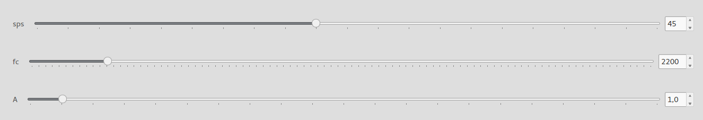

Nesta barra podemo variar a frequência (fc) em um range de 0 à x, e está setado para começar em 2.2kHz ou 4.4kHz dependendo do qual o usuário escolher.
Também, é possível alterar a Amplitude (A) em um range de 0 à 20, e está setado para iniciar com 5 e o sps com um range de 0 a 100, iniciando em 45.

###  Gráfico no tempo e em frequência do sinal não codificado

não conseguimos obter ese gráfico

### Gráfico no tempo e em frequência do sinal codificado
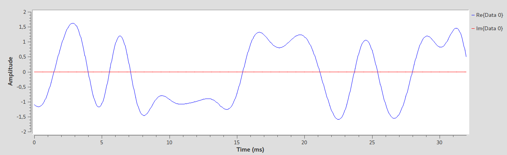
Gráfico do sinal codificado, o qual apresenta valores de 0 e 1, que representao os valores binarios em função do tempo. 

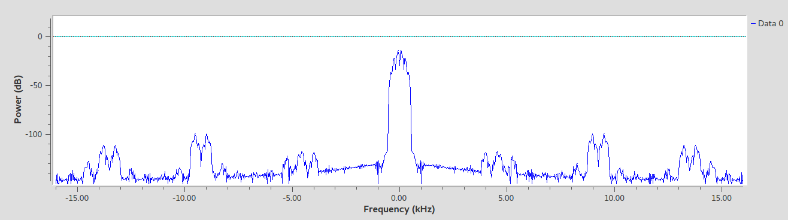
Gráfico do sinal codificado, que representa os vlores binarios em função da frequência.

### Gráfico no tempo e em frequência do sinal modulado
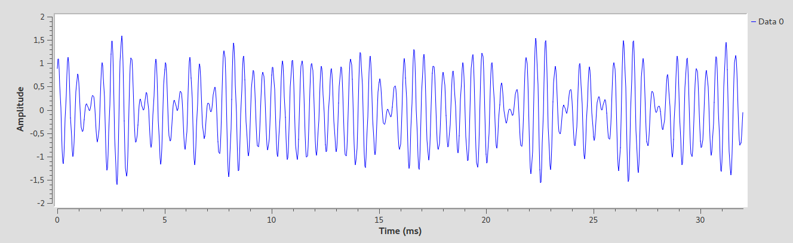  
Gráfico do sinal modulado em função do tempo, com alteração apenas da frequencia  do sinal codificado

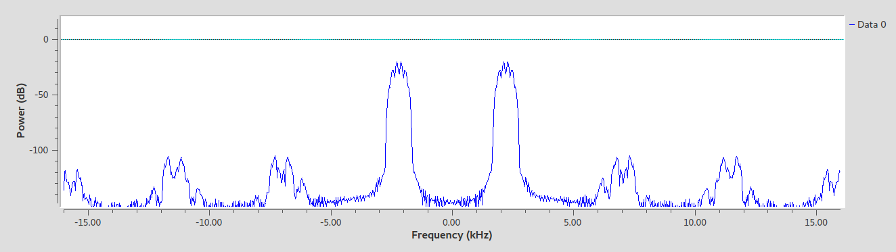
Gráfico do sinal modulado em função da frequencia, com alteração apenas da frequencia do sinal codificado, há o deslocamento do sinal ao multiplica-la pela portadora 

### Diagrama de constelação
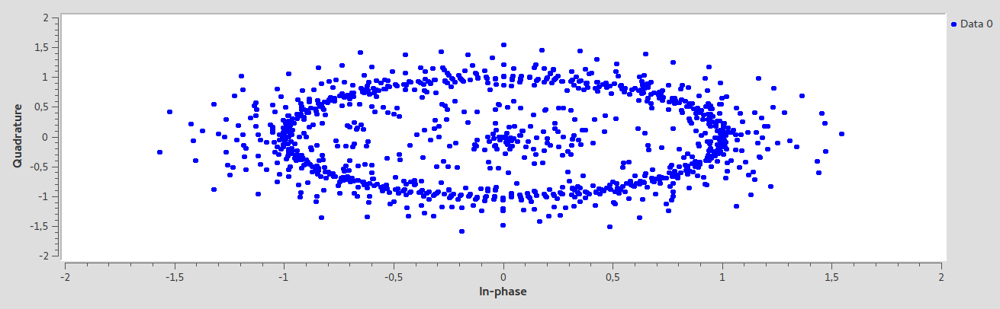
Grafico da representação dos Simbolos enviados.

## RX:

### Sinal de áudio recebido no tempo e em frequência
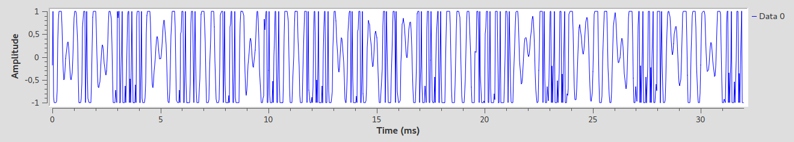
Gráfico do sinal recebido em função do tempo, similar ao grafico no tempo do sinal modulado

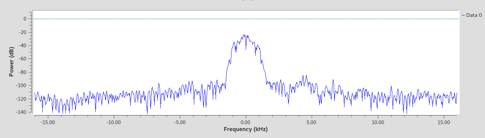
Gráfico do sinal recebido em função da frequência, similar ao gráfico em frequência do sinal modulado 

### Sinal de áudio demodulado no tempo e em frequência
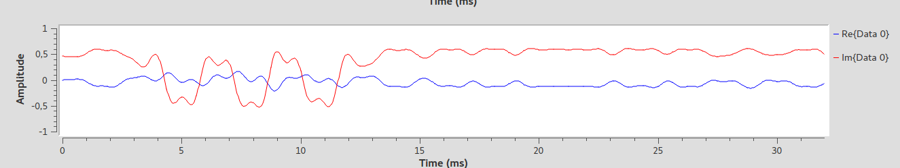
Gráfico do sinal demodulado em função do tempo, similar ao gráfico no tempo do sinal codificado 

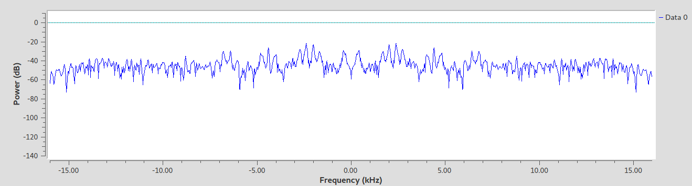
Gráfico do sinal demodulado em função da frequância, similar ao gráfico em frequência do sinal codificado

### Diagrama de constelação.
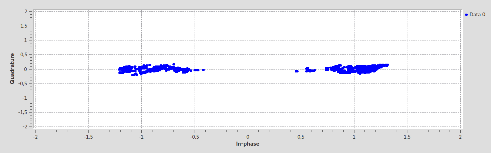
Diagrama de costelação, pode-se notar a distribuição dos pontos nas regioes dos simbolos representados por 0 e 1.

