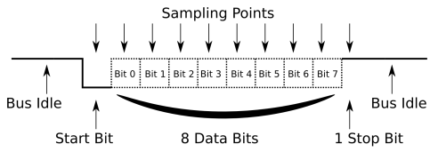
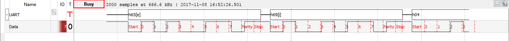

---
title: Camada Física -  APS 8 - Modulação Digital
author: Leonardo Medeiros e Bruna Kimura - leonardopm3@al.insper.edu.br e brunamk@al.insper.edu.br
date: Outubro - 2017
---

# Projeto 3 - Modulação Digital- Camada Fisica
Esse propjeto consiste em implementar uma conexão entre dois computadores utilizando o protocolo uart.

## Protocolo Uart
O protocolo uart é representado pelo seguinte modelo:

O processo inicia com o envio constante do sinal high(1) que indica o estado inicial do sistema e serve como forma de conecção entre os dois computadores. O inicio da recepção de dados ocorre ao receber um start bit, ou seja um bit 0 (Low). Logo em seguida, começa o envio dos dados(payload) a partir do bits mais significativo. O próximo passo é enviar o bit de paridade, porém essa estapa é facultativa, utilizada para detectar erros na transmissão. Para finalizar o envio desse pacote, o stopbit é transmitido, um bit de valor 1 que retorna para o estado inicial de conecção.
O pacote neste caso é montado para cada caracter digitado da mensagem. Estes caracteres são transformados em 8 bits, ou seja 1 byte, segundo a tabela ASCII, se tornando o payload do pacote.

## Resultado WaveForms
Conforme definido no codigo, deve-se conectar o pino 7* do analog discovery no pino TX1 do arduino e também algum dos pinos de terra do analog no terra do arduino (gnd), a fim de analisar os dados enviados graficamente so wav forms. Foi obtido o seguinte grafico.

Em que pode-se verificar a estrutura em uart dos dados recebidos:
Sinal inicial (1)
start bit (0)
payload(10100110)
paridade (1)
stop bit (0)

## Descrição Do Codigo

### Tx

#### Envia Start Bit
Escreve no pino tx o valor do Start Bit(0);
``digitalWrite(uart->pin_tx, LOW);``

#### Envia Payload
Nessa etapa é necessário enviar bite a bite de cada caracter, como é recebido um byte, para obter o bit mais significativo deve-se percorrer o byte realizando um shift auto incrementado para a direita e utilizar um and com um 0x01. 

#### Envia Paridade
Inicialmente deve-se calcular a paridade somando cada bit do dado recebido e verificar se a soma é impar ou par, retornando 1 caso seja par e 0 caso seja impar, forçando a paridade a ser impar.

#### Envia Stop Bit
Escreve no pino tx o valor do Stop Bit(1);
``digitalWrite(uart->pin_tx, high);``

# Rx

#### Confirma Start BIT
Deve-se checar constantemente o valor na porta rx do arduino, esperando por um valor 0, caso essa espera seja satisfeira há uma espera de meio T, em seguida verifica-se se o valor na porta rx ainda 0, caso seja a conexão é estabelecida, essa metodologia é utilizada para evitar erros quanto a detecção do start bit, nâo os confundindo com pequenas variações no sinal devido a ruidos.  

#### Recebe Dados
Essa etapa é similar ao envio de dados, nela também deve-se percorer o dado recebido bite a bite, mas agora deve-se realizar um shift auto incrementado para a esqueda e usar ur or para somar cada bit recebido, reconstruindo o caracter que foi enviado. 

#### Recebe Paridade
Deve-se receber o valor de paridade do pino rx, e compara-lo com o valor de paridade calculado pelo proprio codigo de recebimento, se os valores forem divergentes deve-se descartar o dado e esperar pelo novo envio, caso a paridade seja igual, se armazena o dado.

#### Recebe Stop Bit  
Deve-se receber o valor do stop bit do pino rx, indicando o fim do pacote.

